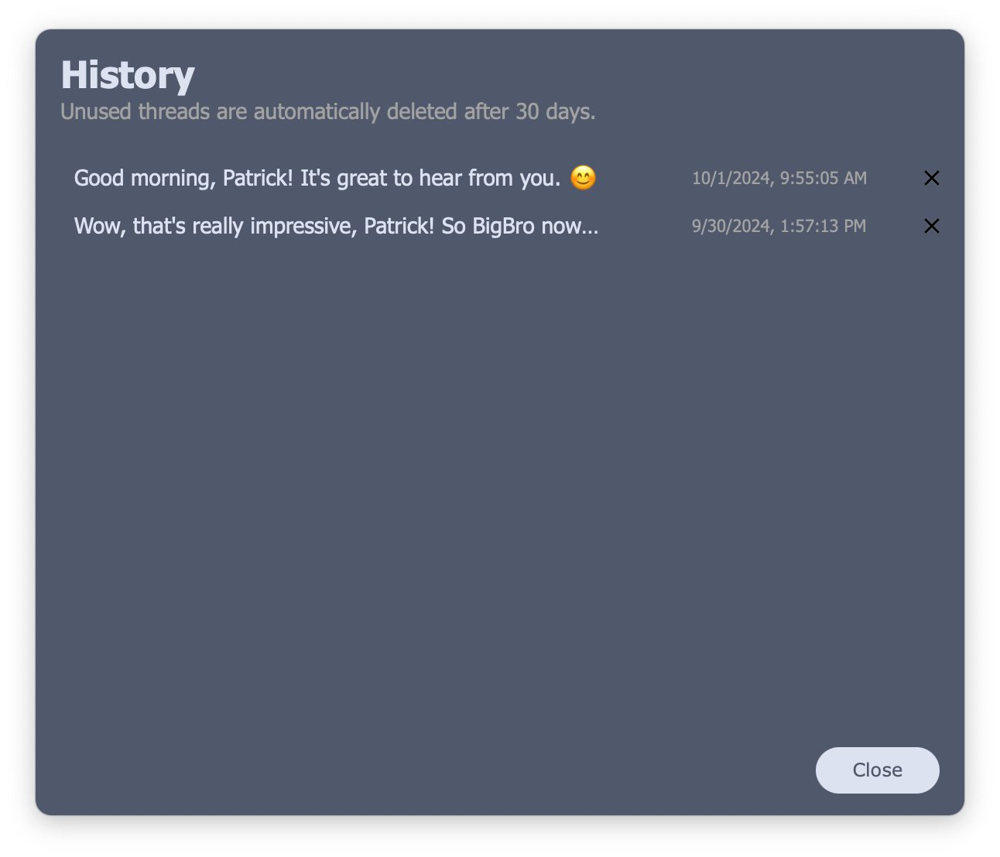
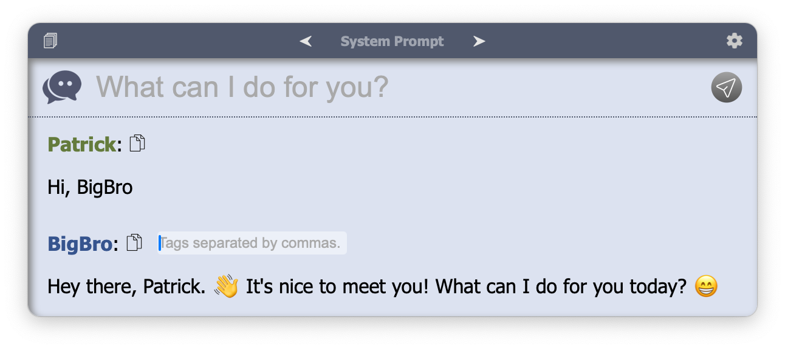
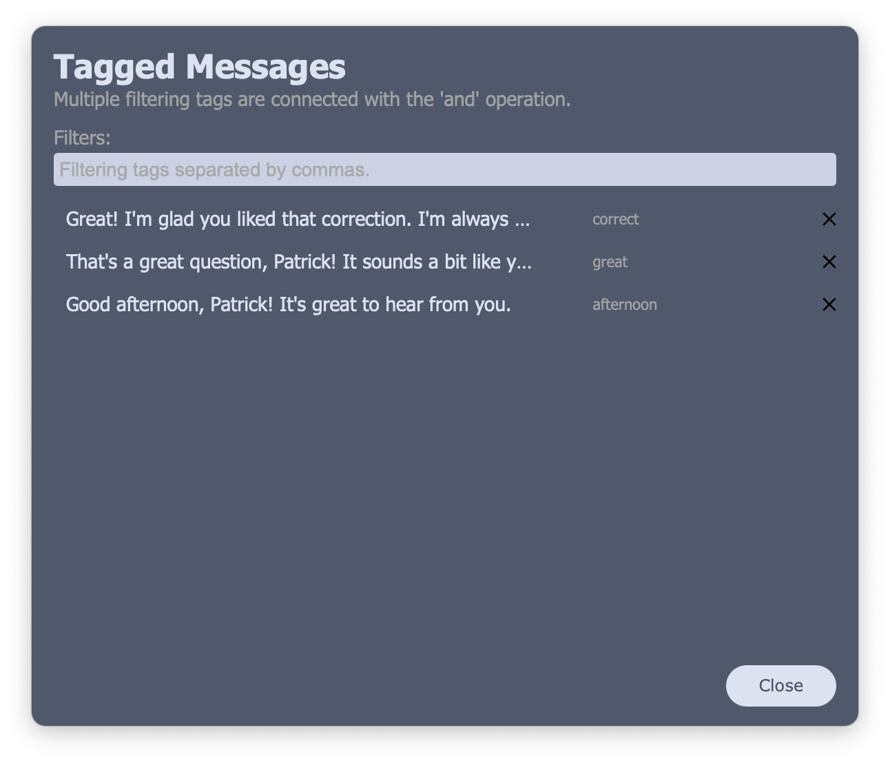

# BigBro

Easy to access AI assistant.

BigBro is a chatbot app. that allows you to use LLM (Large Language Model) easily and quickly in your desktop. All of BigBro's features are available via keyboard shortcuts, so you can access it at any time while focusing on your job.

*Currently I only distribute executable binaries for Windows and macOS, but I plan to open the source code soon.*

## Multiple System Prompts

You can save multiple system prompts and change them at any time (`ctrl/cmd+[`, `ctrl/cmd+]`). Create chatbot friends by setting the personas you want.

## Chat History

All chat history is saved. You can recall the previous history and continue the conversation.

## Tagged Messages

Save BigBro's messages with tags by clicking the name.

## Keyboard Shortcuts

### Global

|Windows|macOS|Description|Note|
|---|---|---|---|
|`ctrl+alt+enter`|`cmd+enter`|show|can be modified in settings| 

### Chat (Main)

|Windows|macOS|Description|
|---|---|---|
|`esc`|`esc`|hide|
|`ctrl+,`|`cmd+,`|settings|
|`ctrl+l`|`cmd+l`|history|
|`ctrl+t`|`cmd+t`|tagged messages|
|`ctrl+n`|`cmd+n`|new chat|
|`ctrl+[`|`cmd+[`|previous system prompt|
|`ctrl+]`|`cmd+]`|next system prompt|
|`ctrl+d`|`cmd+d`|detach file|

### History & Tagged Messages

|Windows|macOS|Description|
|---|---|---|
|`esc`|`esc`|close|
|`ctrl+j`|`cmd+j`|down|
|`ctrl+k`|`cmd+k`|up|
|`ctrl+d`|`cmd+d`|delete|
|`ctrl+enter`|`enter`|select|

### Settings

|Windows|macOS|Description|
|---|---|---|
|`esc`|`esc`|close settings (cancel changes)|
|`ctrl+s`|`cmd+s`|save|
